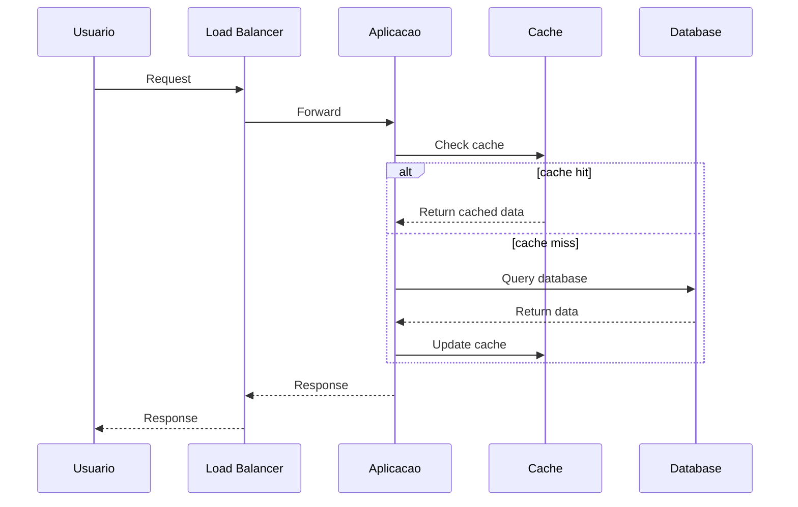

# Application Documentation Template

---

# [Nome da Aplicacao]

## Metadata

| Campo | Valor |
|-------|-------|
| **Nome** | [Nome da Aplicacao] |
| **Versao** | X.Y.Z |
| **Status** | Producao / Beta / Desenvolvimento / Deprecated |
| **Owner** | [Time/Pessoa] |
| **Repositorio** | [link] |
| **Documentacao** | [link] |
| **Criado em** | YYYY-MM-DD |
| **Ultima atualizacao** | YYYY-MM-DD |

## Sumario

[Descricao de 2-3 paragrafos explicando o que a aplicacao faz, qual problema resolve, e quem sao os usuarios]

## Quick Links

| Recurso | Link |
|---------|------|
| Repositorio | [link] |
| Pipeline CI/CD | [link] |
| Dashboard de Metricas | [link] |
| Logs | [link] |
| Alertas | [link] |
| Runbook | [link] |
| API Docs | [link] |

## Arquitetura

### Diagrama de Arquitetura

```
+------------------+     +------------------+     +------------------+
|                  |     |                  |     |                  |
|   Load Balancer  +---->+   Application    +---->+    Database      |
|                  |     |                  |     |                  |
+------------------+     +--------+---------+     +------------------+
                                  |
                                  v
                         +------------------+
                         |                  |
                         |   Cache (Redis)  |
                         |                  |
                         +------------------+
```

### Componentes

| Componente | Descricao | Tecnologia |
|------------|-----------|------------|
| [Componente 1] | [descricao] | [tecnologia] |
| [Componente 2] | [descricao] | [tecnologia] |
| [Componente 3] | [descricao] | [tecnologia] |

### Fluxo de Dados



## Stack Tecnologico

### Backend

| Tecnologia | Versao | Proposito |
|------------|--------|-----------|
| [Linguagem] | X.Y | Runtime principal |
| [Framework] | X.Y | Framework web |
| [ORM] | X.Y | Acesso a dados |

### Frontend (se aplicavel)

| Tecnologia | Versao | Proposito |
|------------|--------|-----------|
| [Framework] | X.Y | UI Framework |
| [Build Tool] | X.Y | Build |

### Infraestrutura

| Tecnologia | Versao | Proposito |
|------------|--------|-----------|
| [Container] | X.Y | Containerizacao |
| [Orchestrator] | X.Y | Orquestracao |
| [Cloud] | - | Cloud provider |

### Banco de Dados

| Database | Versao | Proposito |
|----------|--------|-----------|
| [Database 1] | X.Y | Dados principais |
| [Database 2] | X.Y | Cache |

## Dependencias

### Dependencias de Servico

| Servico | Tipo | Criticidade | Owner |
|---------|------|-------------|-------|
| [Servico 1] | Interno/Externo | Critico/Nao-critico | [time] |
| [Servico 2] | Interno/Externo | Critico/Nao-critico | [time] |

### Dependencias de Biblioteca

[Link para package.json, requirements.txt, go.mod, etc.]

## Configuracao

### Variaveis de Ambiente

| Variavel | Descricao | Obrigatoria | Default |
|----------|-----------|-------------|---------|
| `DATABASE_URL` | URL de conexao com DB | Sim | - |
| `REDIS_URL` | URL do Redis | Sim | - |
| `LOG_LEVEL` | Nivel de log | Nao | `info` |
| `PORT` | Porta da aplicacao | Nao | `8080` |

### Arquivos de Configuracao

| Arquivo | Descricao | Localicazao |
|---------|-----------|-------------|
| `config.yaml` | Configuracao principal | `/app/config/` |
| `secrets.yaml` | Secrets (K8s) | Kubernetes Secret |

### Feature Flags

| Flag | Descricao | Default |
|------|-----------|---------|
| `FEATURE_X` | [descricao] | `false` |
| `FEATURE_Y` | [descricao] | `true` |

## Desenvolvimento Local

### Pre-requisitos

- [Requisito 1] versao X.Y
- [Requisito 2] versao X.Y
- Docker
- Acesso ao repositorio

### Setup

```bash
# Clone o repositorio
git clone [url]
cd [repo]

# Instale dependencias
[comando de instalacao]

# Configure variaveis de ambiente
cp .env.example .env
# Edite .env com suas configuracoes

# Inicie dependencias (Docker)
docker-compose up -d

# Execute a aplicacao
[comando para executar]
```

### Comandos Uteis

```bash
# Executar testes
[comando]

# Executar linter
[comando]

# Build local
[comando]

# Executar migrations
[comando]
```

## Deploy

### Ambientes

| Ambiente | URL | Cluster | Namespace |
|----------|-----|---------|-----------|
| Development | [url] | [cluster] | dev |
| Staging | [url] | [cluster] | staging |
| Production | [url] | [cluster] | production |

### Pipeline CI/CD

```
+--------+     +--------+     +--------+     +--------+     +--------+
|  Push  | --> |  Build | --> |  Test  | --> | Deploy | --> | Verify |
|        |     |        |     |        |     | (auto) |     |        |
+--------+     +--------+     +--------+     +--------+     +--------+
```

### Como fazer Deploy

1. Merge PR para branch `main`
2. Pipeline automatico inicia
3. Deploy automatico para staging
4. Aprovacao manual para producao (se aplicavel)
5. Deploy para producao

### Rollback

```bash
# Via kubectl
kubectl rollout undo deployment/[deployment-name] -n [namespace]

# Via CI/CD
[instrucoes especificas]
```

## API

### Endpoints Principais

| Metodo | Endpoint | Descricao |
|--------|----------|-----------|
| GET | `/health` | Health check |
| GET | `/ready` | Readiness check |
| GET | `/api/v1/[resource]` | Lista recursos |
| POST | `/api/v1/[resource]` | Cria recurso |
| GET | `/api/v1/[resource]/{id}` | Obtem recurso |
| PUT | `/api/v1/[resource]/{id}` | Atualiza recurso |
| DELETE | `/api/v1/[resource]/{id}` | Deleta recurso |

### Autenticacao

[Descricao do metodo de autenticacao - JWT, API Key, OAuth, etc.]

### Rate Limiting

| Endpoint | Limite |
|----------|--------|
| `/api/*` | 100 req/min |
| `/health` | Sem limite |

## Monitoramento

### Health Checks

| Check | Endpoint | Intervalo |
|-------|----------|-----------|
| Liveness | `/health` | 10s |
| Readiness | `/ready` | 5s |

### Metricas

| Metrica | Tipo | Descricao |
|---------|------|-----------|
| `http_requests_total` | Counter | Total de requests |
| `http_request_duration_seconds` | Histogram | Latencia |
| `db_connections_active` | Gauge | Conexoes ativas |

### Dashboard

- **Grafana:** [link]
- **Principais paineis:**
  - Request rate
  - Error rate
  - Latency (p50, p90, p99)
  - Resource usage

### Alertas

| Alerta | Condicao | Severidade |
|--------|----------|------------|
| High Error Rate | error_rate > 5% | Critical |
| High Latency | p99 > 2s | Warning |
| Pod Restarts | restarts > 3 | Warning |

## Logs

### Formato de Log

```json
{
  "timestamp": "2024-01-15T10:30:00Z",
  "level": "info",
  "message": "Request processed",
  "trace_id": "abc123",
  "duration_ms": 50
}
```

### Como Acessar Logs

```bash
# Kubernetes
kubectl logs -f deployment/[name] -n [namespace]

# Via ferramenta de log
[instrucoes para Loki, ELK, CloudWatch, etc.]
```

### Queries Uteis

```
# Erros
{app="[app-name]"} |= "error"

# Requests lentos
{app="[app-name]"} | json | duration_ms > 1000
```

## Troubleshooting

### Problemas Comuns

#### Problema 1: [Descricao]

**Sintomas:**
- [sintoma 1]
- [sintoma 2]

**Causa provavel:**
[causa]

**Solucao:**
```bash
[comandos para resolver]
```

#### Problema 2: [Descricao]

**Sintomas:**
- [sintoma 1]
- [sintoma 2]

**Causa provavel:**
[causa]

**Solucao:**
```bash
[comandos para resolver]
```

### Comandos de Debug

```bash
# Verificar status dos pods
kubectl get pods -n [namespace] -l app=[app-name]

# Ver logs
kubectl logs -f deployment/[name] -n [namespace]

# Exec no container
kubectl exec -it [pod-name] -n [namespace] -- /bin/sh

# Port forward
kubectl port-forward svc/[service] 8080:80 -n [namespace]
```

### Escalacao

| Nivel | Condicao | Contato |
|-------|----------|---------|
| L1 | Problemas operacionais | [time/canal] |
| L2 | Bugs complexos | [time/canal] |
| L3 | Arquitetura/Design | [time/canal] |

## Seguranca

### Autenticacao/Autorizacao

[Descricao de como auth funciona]

### Secrets

| Secret | Descricao | Rotacao |
|--------|-----------|---------|
| `db-credentials` | Credenciais do DB | 90 dias |
| `api-key` | API key externa | 30 dias |

### Compliance

- [ ] SOC2
- [ ] GDPR
- [ ] PCI-DSS

## SLOs

| SLO | Target | Medicao |
|-----|--------|---------|
| Availability | 99.9% | Uptime |
| Latency (p99) | < 500ms | Response time |
| Error Rate | < 0.1% | 5xx responses |

## Contatos

| Papel | Contato |
|-------|---------|
| Time Owner | [email/slack] |
| Tech Lead | [email/slack] |
| On-call | [canal/pagerduty] |

## Changelog

### [X.Y.Z] - YYYY-MM-DD
- Added: [feature]
- Changed: [mudanca]
- Fixed: [bug fix]

### [X.Y.Z-1] - YYYY-MM-DD
- Added: [feature]
- Changed: [mudanca]

## Referencias

- [Design Doc original]
- [ADRs relacionados]
- [Documentacao da API]
- [Runbook]
